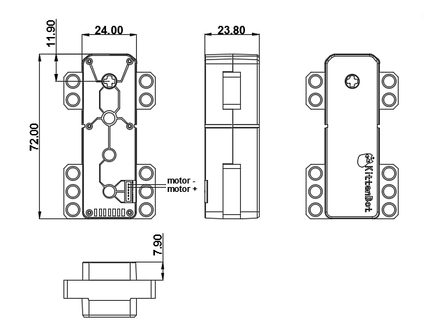
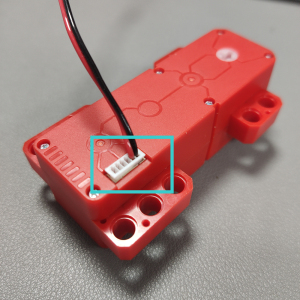
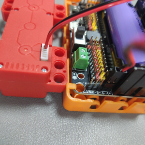
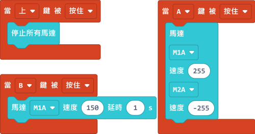

# 高速直流電機

高速直流電機

這是一款兼容樂高插孔的高速直流電機，它的轉速是9g電機的3倍。輸出軸為兩組樂高十字孔，主要用在驅動需求快速的機械，最適合製作競速類形的小車。

## 產品參數

- 工作電壓：3.3V~6V
- 額定電壓：4.8V
- 額定電流：200mA
- 堵轉電流：1800mA   
- 最高轉速：200rpm
- 停止扭力：1000g
- 重量：44g
- 接口：紅黑線，防反插接口

## 產品特色：

- 採用十字沉孔作輸出軸
    - 可以因使用情況自由插入不同長度的十字軸

- 轉速更高
    - 轉速為GeekMotor 9G的三倍左右

- 使用碳刷電機
    - 壽命長噪音小

## 規格尺寸

### 樂高孔單位:

- 長度：10孔
- 闊度：5孔
- 高度：3孔
- 輸出軸：樂高十字軸

### mm單位:

- 長度：72mm
- 闊度：39mm
- 高度：23.8mm
- 輸出軸：樂高十字軸

## 接線方法

由於Robotbit的驅動能力最佳，所以本教程以Robobit作例子。當然你亦可以使用Armourbit。
    
### Robotbit

---

將防反插接口插上電機。

將電機的紅黑線連接至Robotbit的電機接口。

    沒有嚴格正負極之分，插的方向只會影響電機轉動方向。

## MakeCode編程教學

### 此模組可供Microbit和Meowbit使用。

### ArmourBit

--------

### 加載Powerbrick插件：

### 在擴展頁直接搜尋Powerbrick (powerbrick已經過微軟認證，可以直接搜尋)

### [詳細方法](../Makecode/powerBrickMC)

### 電機積木塊:

## 電機編程

[參考程式下載](https://bit.ly/PowerbrickM11_01Hex)

[參考程式網址](https://makecode.microbit.org/_RYHivyayYL4q)

### RobotBit

---

### 加載Robotbit插件：

### [詳細方法](../Makecode/powerBrickMC)

### 電機積木塊:

### 電機編程

[參考程式網址](https://makecode.microbit.org/_33HMywgx9H97q)

### Meowbit:

---

### 加載robotbit插件：https://github.com/KittenBot/meow-robotbit

### [詳細方法](../Makecode/powerBrickMC)

### 電機積木塊:

## 電機編程

[參考程式網址](https://makecode.com/_2z0C8v6XAC5y)

## 插件版本與更新

插件可能會不定時推出更新，改進功能。亦有時候我們可能需要轉用舊版插件才可使用某些功能。

詳情請參考: [Makecode插件版本更換](../Makecode/makecode_extensionUpdate)

## KittenBlock編程教學

### Armourbit

--- 

### 加載PowerBrick插件

在左上角小貓logo旁邊的硬件欄選擇PowerBrick，加載Microbit與Powerbrick插件。

### 電機積木塊

### 電機編程

[參考程式下載](https://bit.ly/PowerbrickM11_01sb3)

[參考程式網址](https://makecode.microbit.org/_RYHivyayYL4q)

### Robotbit

---

### 加載Robotbit插件

在左上角小貓logo旁邊的硬件欄選擇Microbit，加載Microbit與Robotbit插件。

### 電機積木塊

### 電機編程

## FAQ

1：為什麼我點擊積木塊沒有反應呢？

首先確保已經連接好Microbit，然後上載韌體再試一試。