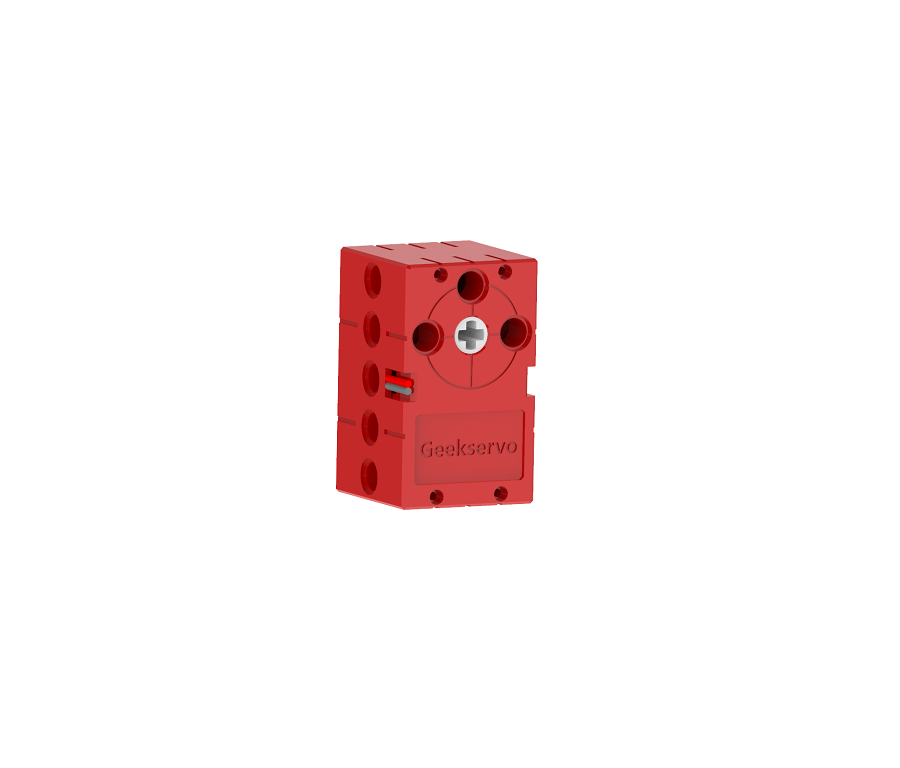
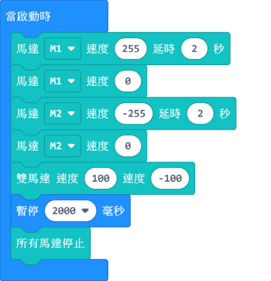

# GeekServo 2KG電機

2KG電機 (HKBD8009A)

這是一款兼容樂高插孔的高扭力的電機，相對於9g電機，在同等供電下具有更高轉速。輸出軸為兩組樂高十字孔，主要用在驅動動力機械。

## 產品參數

- 工作電壓：3.3V~6V
- 額定電壓：4.8V
- 額定電流：70mA
- 堵轉電流：900mA   
- 打滑電流：700mA
- 最大扭力：1.6kg±0.2kg/cm(4.8V)
- 最高轉速：45rpm(3V供電情况下)
- 重量：20g
- 接口：紅黑線

## 產品特色：

繼承了GeekServo 9G舵機電機的優點，增強了扭力與速度，改善了結構

- 採用十字沉孔作輸出軸
    - 可以因使用情況自由插入不同長度的十字軸

- 轉動角度更大
    - 舵機控制範圍為0至360度

- 扭力更大
    - 扭力為GeekServo 9G的三倍左右

## 規格尺寸

### 樂高孔單位:

- 長度：5孔
- 闊度：3孔
- 高度：3孔
- 輸出軸：樂高十字軸

### mm單位:

- 長度：40mm
- 闊度：24mm
- 高度：24mm
- 輸出軸：樂高十字軸

## 接線方法

將電機的紅黑線連接至Armourbit底部的電機接口。

    沒有嚴格正負極之分，插的方向只會影響電機轉動方向。

## MakeCode編程教學

### 加載PowerBrick插件：https://github.com/KittenBot/pxt-powerbrick

### 電機積木塊:

### 電機編程

[參考程式下載](https://bit.ly/PowerbrickM11_01Hex)

## KittenBlock編程教學

### 加載PowerBrick插件

離線版與在線版同樣操作。

在左上角小貓logo旁邊的硬件欄選擇PowerBrick，加載Microbit與Powerbrick插件。

### 電機積木塊

### 電機編程

[參考程式下載](https://bit.ly/PowerbrickM11_01sb3)

## FAQ

1：為什麼我點擊積木塊沒有反應呢？

首先確保已經連接好Microbit，然後上載韌體再試一試。