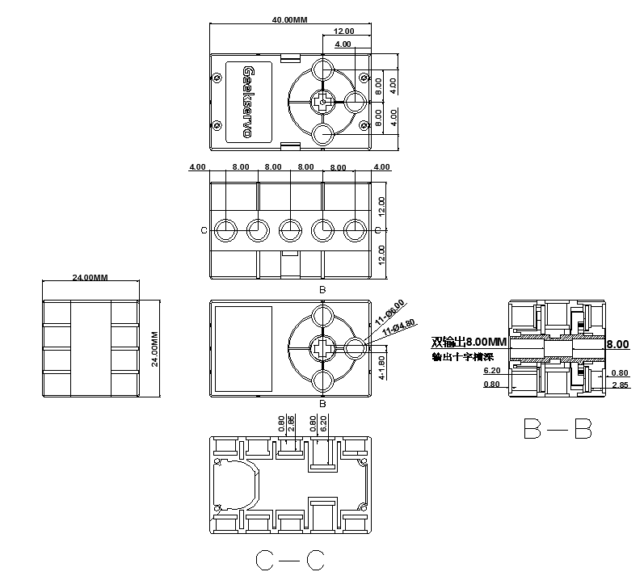
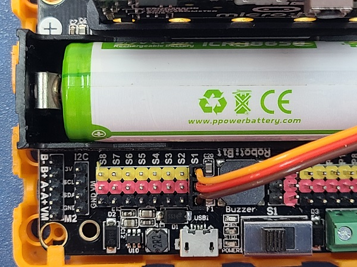
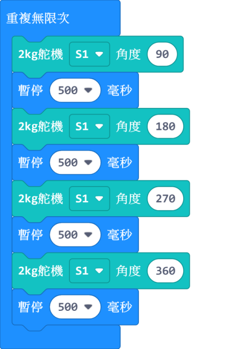
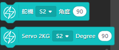

# GeekServo 2KG舵機

2KG舵機 (HKBD8008A)

這是一款兼容樂高插孔的高扭力的舵機，相對於9g舵機，在同等供電下具有更高扭力。輸出軸為兩組樂高十字孔，主要用在需求精細控制的結構上。

## 產品參數

- 工作電壓：3.3V~6V
- 額定電壓：4.8V
- 額定電流：70mA
- 堵轉電流：900mA   
- 打滑電流：700mA
- 最大扭力：1.6kg±0.2kg/cm(4.8V)
- 角度轉速：60°/0.14s
- 角度範圍：0°~360°
- 重量：20g
- 接口：橙紅啡線

## 產品特色：

繼承了GeekServo 9G舵機電機的優點，增強了扭力與速度，改善了結構

- 採用十字沉孔作輸出軸
    - 可以因使用情況自由插入不同長度的十字軸
- 雙邊輸出
    - 左右均有輸出軸

- 轉動角度更大
    - 舵機控制範圍為0至360度

- 扭力更大
    - 扭力為GeekServo 9G的三倍左右

## 規格尺寸

### 樂高孔單位:

- 長度：5孔
- 闊度：3孔
- 高度：3孔
- 輸出軸：樂高十字軸

### mm單位:

- 長度：40mm
- 闊度：24mm
- 高度：24mm
- 輸出軸：樂高十字軸

## 接線方法

### ArmourBit

將舵機的橙紅啡線連接至Armourbit背部的舵機接口。

    啡色接負極，紅色接正極，橙色接數據。
    
### RobotBit

將舵機的橙紅啡線連接至RobotBit的舵機接口。

    啡色接負極，紅色接正極，橙色接數據
    
## MakeCode編程教學

### 此模組可供Microbit和Meowbit使用。

### ArmourBit與RobotBit的編程是一樣的。

### ArmourBit

---

### 加載PowerBrick插件：https://github.com/KittenBot/pxt-powerbrick

### [詳細方法](../Makecode/powerBrickMC)

### RobotBit

---

### 加載RobotBit插件：

### 舵機積木塊:

### 舵機編程

[參考程式下載](https://bit.ly/M132kgGeekServoSampleCode)

[參考程式網址](https://makecode.microbit.org/_Fxq45rHFrD8s)

### Meowbit:

---

### 加載robotbit插件：https://github.com/KittenBot/meow-robotbit

### [詳細方法](../Makecode/powerBrickMC)

### 舵機積木塊:

## 舵機編程

[參考程式網址](https://makecode.com/_2syJW2iFPUMx)

## 插件版本與更新

插件可能會不定時推出更新，改進功能。亦有時候我們可能需要轉用舊版插件才可使用某些功能。

詳情請參考: [Makecode插件版本更換](../Makecode/makecode_extensionUpdate)

## KittenBlock編程教學

### Armourbit，Robotbit與Meowbit編程方法一樣，請加載相應插件

### 加載PowerBrick插件

在左上角小貓logo旁邊的硬件欄選擇PowerBrick，加載Microbit與Powerbrick插件。

### 舵機積木塊

### 舵機編程

[參考程式下載](https://bit.ly/M132kgGeekServoSampleCode)

## FAQ

1：為什麼我點擊積木塊沒有反應呢？

首先確保已經連接好Microbit，然後上載韌體再試一試。