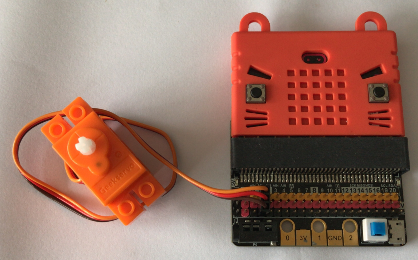
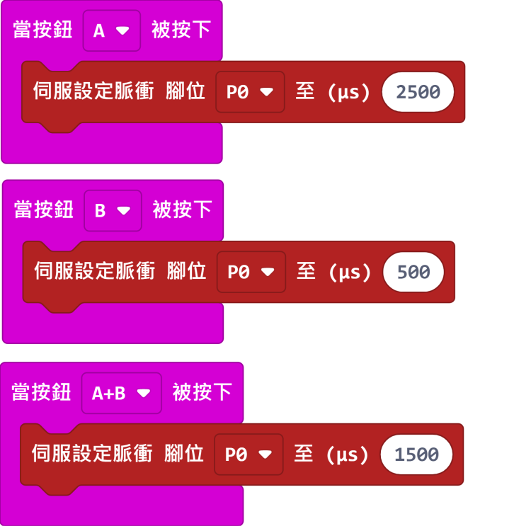
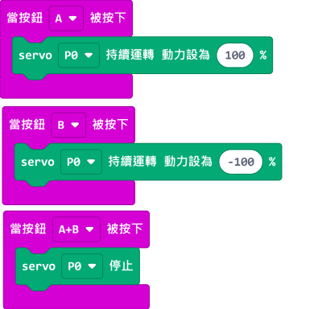

# Geek Motor O360 續轉舵機

Geek Motor O360 續轉舵機(HKBD8001A)

這是一款兼容樂高件的續轉舵機，是可以當作電機使用，輸出軸為樂高十字軸。主要用作驅動如車子，齒輪般動力機械。它的特別在於不需要舵機驅動或電機驅動芯片，可以直接用引腳驅動，適合用於例如IOBit等沒有驅動芯片的擴展板。

## 產品參數

- 工作電壓：3.3V~6V
- 額定電壓：4.8V
- 額定電流：200ma
- 堵轉電流：700ma
- 打滑電流：450ma
- 最大扭力：500g/cm(4.8V)
- 轉速：70rpm
- 重量：12.4g
- 接口：橙紅啡線

## Geekservo特色

- 極力子過載保護:
    - 遇到輸出軸被暴力扭擰會啟動極力子進行跳齒保護，發出「噠噠噠」的聲音。不會損毀齒輪。

- 安裝方式靈活:
    - 支援樂高標準磚和Technic插孔，輸出軸亦是樂高標準十字軸。

- 輕盈小巧:
    - 方便製作各種小型機械。
    
- 不需要驅動芯片:
    - 適合用於沒有驅動芯片的擴展板。
    
## 規格尺寸

### 樂高孔單位:

- 長度：5孔
- 闊度：2孔
- 高度：3孔
- 輸出軸：樂高十字軸

### mm單位:

- 長度：40mm
- 闊度：16mm
- 高度：34.4mm
- 輸出軸：樂高十字軸

    
## 接線方法

### IOBit

將舵機連接到IOBit的類比引腳。

    可以使用3v或者5v。
    啡色接負極，紅色接正極，橙色接數據。   
    

## MakeCode編程教學

### 此模組可供Microbit和Meowbit使用。

## 電機編程(方法1)

續轉舵機需要使用伺服脈衝積木。

續轉舵機控制數值範圍由500至2500。詳細可以參考這個圖表。

    500為反方向全速轉動，2500為正方向全速轉動，1500為停止轉動。

[參考程式網址](https://makecode.microbit.org/_Ub76W98a29A2)

## 電機編程(方法2)

### 加載Servo插件

### [詳細方法](../Makecode/powerBrickMC)

[參考程式網址](https://makecode.microbit.org/_JdJDbv5ue97t)

## 示範短片

### Meowbit:

---

### 加載robotbit插件：https://github.com/KittenBot/meow-robotbit

### 電機積木塊:

## 電機編程

[參考程式網址](https://makecode.com/_DPeAM8h5HMaf)

