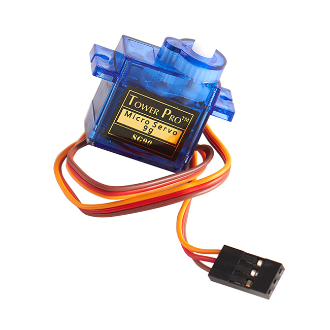
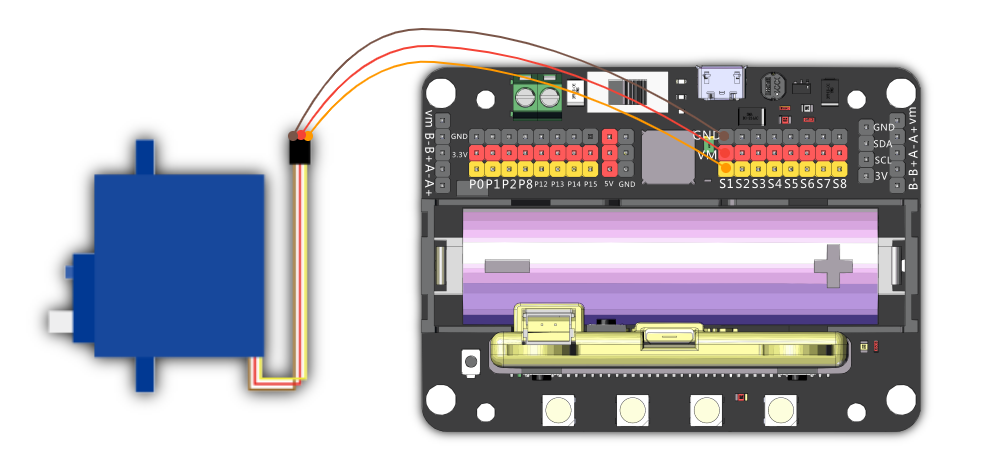
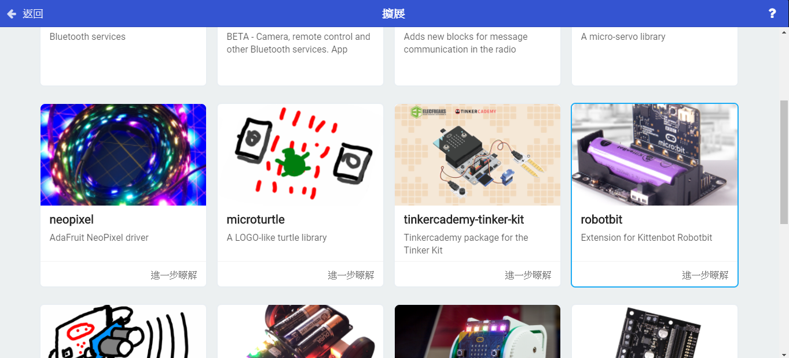
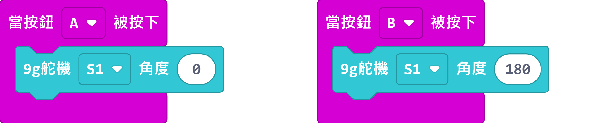
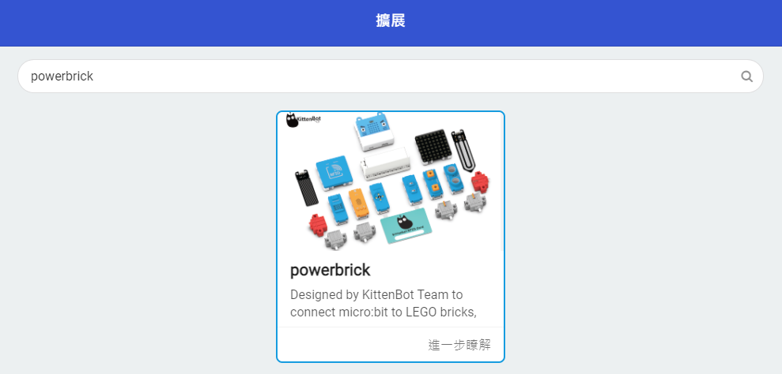
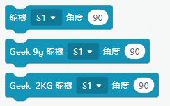
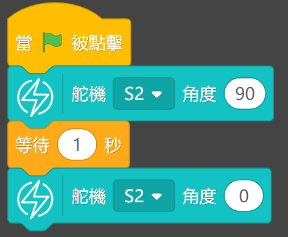

# 9g小舵機

9g小舵機(HKBD8010A)

這是一款小型舵機，是製作入門機械人不可或缺的配件之一。

## 產品參數

- 工作電壓：3.3V~6V
- 額定電壓：4.8V
- 最大扭力：1.6kg±0.2kg/cm(4.8V)
- 角度範圍：0°~180°
- 重量：9g
- 接口：橙紅啡線

## 接線方法

將舵機的橙紅啡線連接至RobotBit的舵機接口。

    啡色接負極，紅色接正極，橙色接數據

## MakeCode編程教學

### 此模組可供Microbit和Meowbit使用。

### RobotBit

---

### 加載RobotBit插件：

### 舵機積木塊:

### 舵機編程

[參考程式網址](https://makecode.microbit.org/_XkbgVe1cjV9A)

### Meowbit:

---

### 加載Powerbrick插件：

### 在擴展頁直接搜尋Powerbrick (powerbrick已經過微軟認證，可以直接搜尋)

### [詳細方法](../Makecode/powerBrickMC)

### 舵機積木塊:

## 舵機編程

[參考程式網址](https://makecode.com/_bg8TEK38jP6a)

## 插件版本與更新

插件可能會不定時推出更新，改進功能。亦有時候我們可能需要轉用舊版插件才可使用某些功能。

詳情請參考: [Makecode插件版本更換](../Makecode/makecode_extensionUpdate)

## KittenBlock編程教學

### Armourbit，Robotbit與Meowbit編程方法一樣，請加載相應插件

### 加載PowerBrick插件

在左上角小貓logo旁邊的硬件欄選擇PowerBrick，加載Microbit與Powerbrick插件。

### 舵機積木塊

### 舵機編程

[參考程式下載](https://bit.ly/PowerbrickM12_01sb3)

## FAQ

1：為什麼我點擊積木塊沒有反應呢？

首先確保已經連接好Microbit，然後上載韌體再試一試。