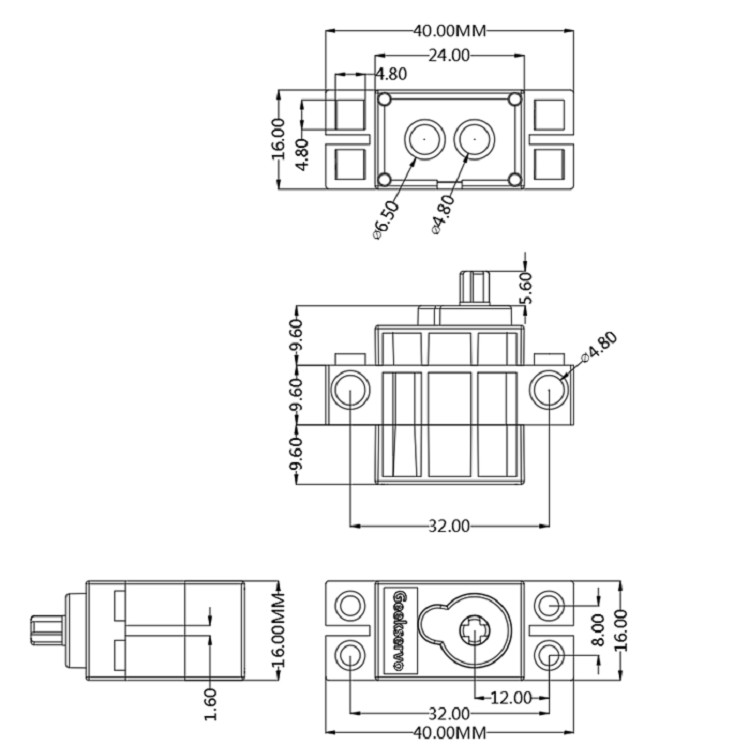

# Geekservo電機

Geekservo電機 (HKBD9006A)

這是一款兼容樂高件的減速直流電機，輸出軸為樂高十字軸。主要用作驅動如車子，齒輪般動力機械。

## 產品參數

- 工作電壓：3.3V~6V
- 額定電壓：4.8V
- 額定電流：200ma
- 堵轉電流：700ma
- 打滑電流：450ma
- 最大扭力：500g/cm(4.8V)
- 最高轉速：70rpm(3V供電情况下)
- 重量：12.4g
- 接口：紅黑線
    
## 使用注意事項

- 這只是一種小型電機，使用情境的扭力和電壓需求請不要過大。
- Geekservo電機沒有線序要求，調換線序只影響轉動方向。
- 禁止長時間超出堵轉電流，否則會燒壞電機。

## 規格尺寸

### 樂高孔單位:

- 長度：5孔
- 闊度：2孔
- 高度：3孔
- 輸出軸：樂高十字軸

### mm單位:

- 長度：40mm
- 闊度：16mm
- 高度：34.4mm
- 輸出軸：樂高十字軸

## Geekservo特色

- 極力子過載保護:
    - 遇到輸出軸被暴力扭擰會啟動極力子進行跳齒保護，發出「噠噠噠」的聲音。不會損毀齒輪。

- 安裝方式靈活:
    - 支援樂高標準磚和Technic插孔，輸出軸亦是樂高標準十字軸。

- 輕盈小巧:
    - 方便製作各種小型機械。

## 接線方法

將電機的紅黑線連接至Armourbit底部的電機接口。

    沒有嚴格正負極之分，插的方向只會影響電機轉動方向。

## MakeCode編程教學

### 加載PowerBrick插件：https://github.com/KittenBot/pxt-powerbrick

### 電機積木塊:

## 電機編程

[參考程式下載](https://bit.ly/PowerbrickM11_01Hex)

### Makecode教學短片

## KittenBlock編程教學

### 加載PowerBrick插件

離線版與在線版同樣操作。

在左上角小貓logo旁邊的硬件欄選擇PowerBrick，加載Microbit與Powerbrick插件。

### 電機積木塊

### 電機編程

[參考程式下載](https://bit.ly/PowerbrickM11_01sb3)

## FAQ

1：為什麼我點擊積木塊沒有反應呢？

首先確保已經連接好Microbit，然後上載韌體再試一試。