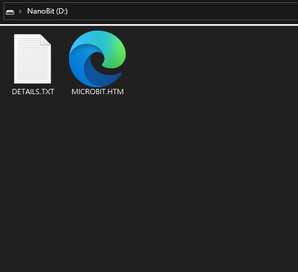

# Nanobit在MakeCode編程

Nanobit的編程方法與BBC Micro:bit是一樣的，只是缺少了LED點陣屏，所以大家只需要按照BBC Micro:bit的編程方法就可以了。

## 使用Nanobit程式下載器

在Nanobit上你不會看到USB接口，這是因為Nanobit的程式下載需要使用下載器，請如圖片將下載器插接到Nanobit，插接時請注意方向。

將USB線插到下載器上，在電腦會出現一個叫Nanobit的裝置，將MakeCode程式下載到下載器上就可以了，程式會自動寫入到Nanobit裏。