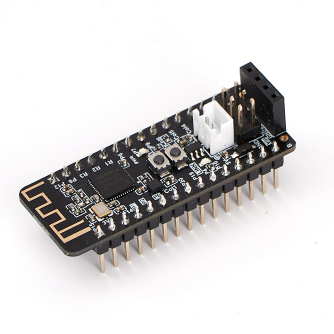
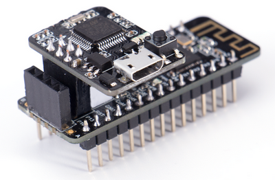

# Nanobit

Nanobit是Kittenbot開發的主控板，其功能與BBC Micro:bit基本上無異，唯一的差異就是Nanobit沒有了Micro:bit的點陣屏，不過正正是因為Nanobit捨去了點陣屏所以Nanobit可以將之前被點陣屏使用的數支引腳放出來使用。

雖然Nanobit體積小巧，但是五臟俱全，板上載有多款實用感應器，包括可編程按鍵、3軸加速器、溫度感應器，確保Nanobit的功能不會缺乏。 Nanobit不但功能與Micro:bit相同，就連編程的方法都一樣。Nanobit可以完美地使用MakeCode進行編程。

Nanobit的細小體積是為了方便創客而設計的，方便大家以細小的主控板創作功能齊備的應用。

## 適合人群

- 學校/培訓機構
- 創客

## 產品特色

- 體積細小、五臟俱全，方便製作細小又有豐富功能的應用
- 支援MakeCode編程，圖像化的編程使入門門檻更加低，Micro:bit的用家可以即時上手
- I2C接口的引腳排序符合OLED顯示屏的排序，可以輕易插接OLED顯示屏
- 完全支援Arduino Nano的擴展板，KittenBot亦都開發了自家的Nanobit Shield，為Nanobit帶來鋰電池與驅動能力
- 引腳採用常見的杜邦針頭，方便插接到麵包板或者傳統感應器

## 產品內容

- Nanobit x1
- Nanobit程式下載器 x1

## 產品參數

- 呎吋: 18.3 x 75 x 17 mm
- 重量: 6.9g 
- 主控芯片: nRF51822  ARM Cortex-M0
- 供電電壓: 3.7V(鋰電池)/5V(USB)
- 引腳輸出電壓: 3.7V/5V
- 工作電壓: 3.7V
- 板載資源: 可編程按鍵 x2、溫度感應器、磁力感應器、3軸陀螺儀、無綫2.4G與藍芽、I2C接口、可編程LED(P15)
- 編程平台: Microsoft MakeCode、KittenBlock、Python編輯器、Arduino IDE
- 麵包板上呎吋: 6x15

## Nanobit詳細引腳圖

## Nanobit程式下載器

需要注意Nanobit的程式下載器的插接方向。

