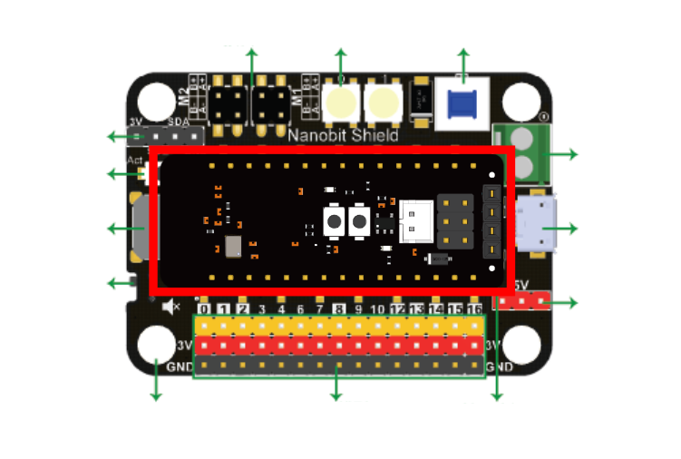

# Nanobit Shield擴展板

Nanobit已經支援市面上大多數Arduino Nano的擴展板，不過KittenBot亦都自家開發了專為Nanobit而設計的Nanobit Shield，不但將Nanobit的引腳引出成為2.54間距的杜邦線感應器接口，亦都為Nanobit帶來電機驅動能力與聲和光的能力，更加為Nanobit提供穩定的鋰電池電源。

## 產品特色

- 體積細小，搭載電機驅動，可以製作更加細小的小車應用
- 板載電池座，可以使用鋰電池。板上亦搭載充放電管理電路，確保電源的穩定和安全性
- 板上設有兼容樂高插孔的結構孔，令機械結構更自由更靈活

## 產品參數

- 呎吋: 78  x 57 x 23 mm
- 重量: 37.5g
- 供電方式: 3.7V(14650鋰電池)/5V(USB)
- 工作電壓: 3.7V
- Vin外接電源: 最大5V 3A
- 板載資源: 2.54間距SVG杜邦連接頭 *15、蜂鳴器、RGB LED *2、電機接口 *4、I2C杜邦接口、5V輸出接口 *3、電源按鈕、電源重置按鈕、USB充電接口、外部電源輸入接口

## 詳細板載資源圖解

## 連接方法

請如圖將Nanobit插在Nanobit Shield上，將Nanobit的VIN對準Nanobit Shield的VIN引腳插到板上，並將引腳完全插入插槽。

## MakeCode編程教學

### Nanobit Shield插件地址: https://github.com/Kittenbot/pxt-nanobit

### Nanobit Shield插件積木塊:

### 範例程式: 控制電機

    注意：Nanobit Shield上的USB插口只是用來充電，要下載程式請使用Nanobit下載器。

### 範例程式: 板載RGB燈條

    注意：Nanobit Shield上的USB插口只是用來充電，要下載程式請使用Nanobit下載器。

