# Kittenbot模組與Bricklink Studio

透過Bricklink Studio，可以利用Kittenbot的各種模組在虛擬環境裏搭建出不同的模型，然後自動生成搭建說明書，是老師備課的好夥伴！

## Bricklink Studio介紹

Bricklink Studio是由Bricklink專為樂高愛好者而開發的一個程式，這個程式提供一個簡單易用的平台讓用家自由利用樂高積木進行創作，並且能夠讓用家在程式裡生成搭建說明書，讓用家可以將創作分享給別人。

由於KittenBot的旗下產品都是與樂高積木的Technic體系兼容。為了顧及學校或教育機構設計課程的需要，KittenBot已經將旗下產品數碼化，變成可以在Bricklink Studio裡面使用的積木件，老師設計完模型之後就可以生成搭建說明書，在課堂上使用。

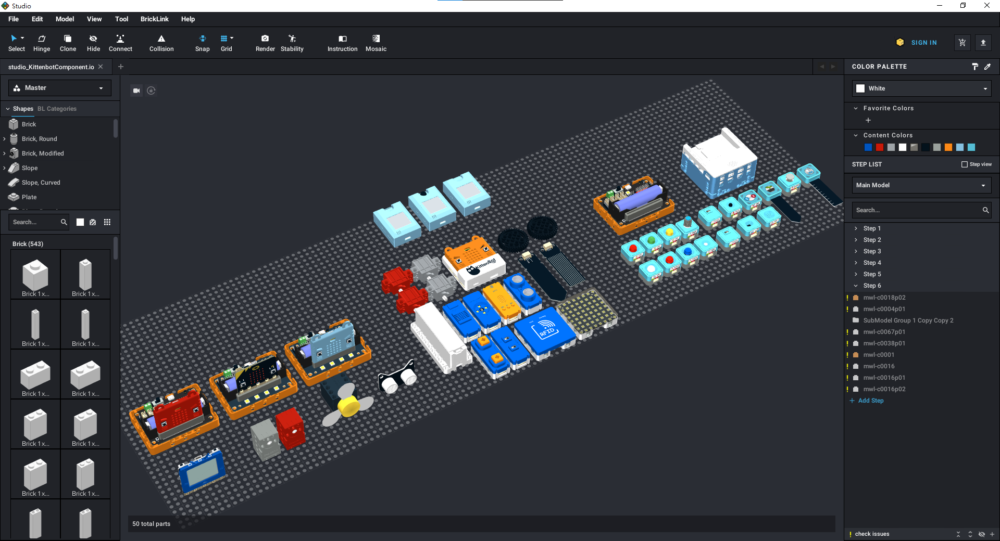

## Bricklink Studio安裝

前往Bricklink官網下載Bricklink Studio。

[Bricklink Studio下載](https://www.bricklink.com/v3/studio/download.page)

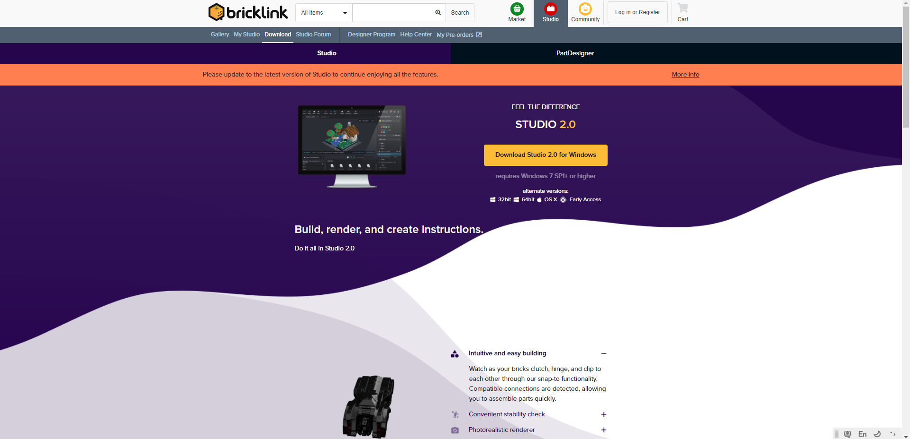

按照指示安裝Bricklink Studio。

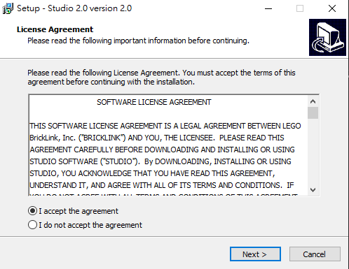

打開Bricklink Studio。

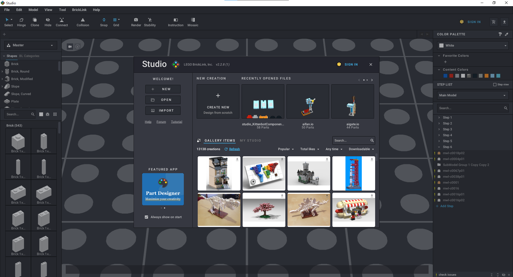

## 在Bricklink Studio裏使用KittenBot模組

在此階段，KittenBot HK暫時未開放讓任何人都可以下載KittenBot自家積木的檔案，如欲使用KittenBot的模組在Bricklink Studio搭建模型，請以WhatsApp查詢KittenBot HK。

### [WhatsApp查詢](https://api.whatsapp.com/send?phone=85296480090&text=你好,我想查詢關於Bricklink%20Studio與KittenBot模組的資料)

大家會收到一個studio_KittenBotComponent.io的檔案。

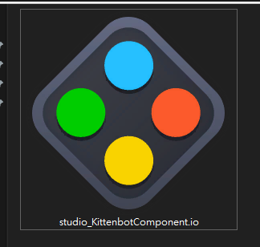

在Bricklink Studio打開這個檔案。

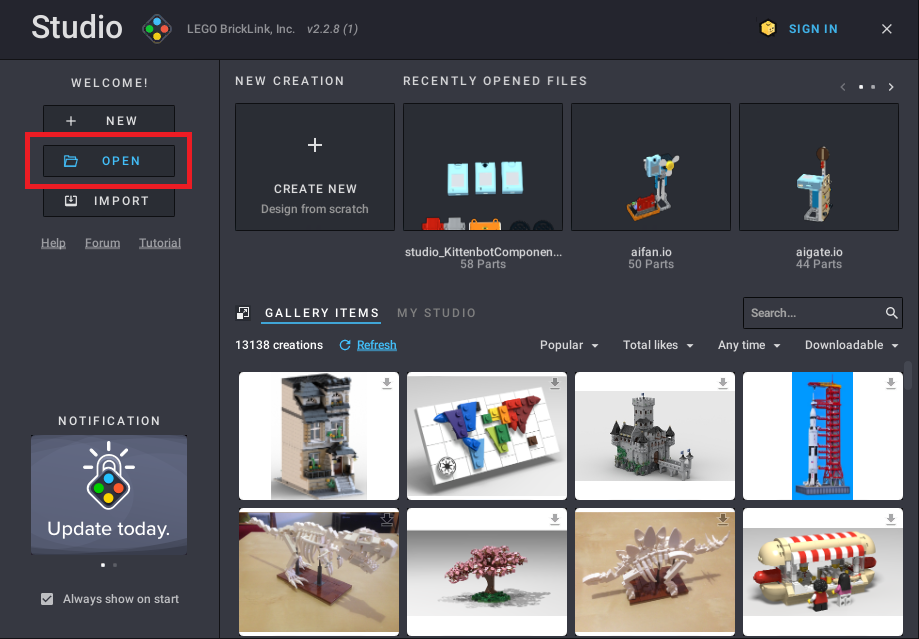

選擇想用的模組並且右擊複製。

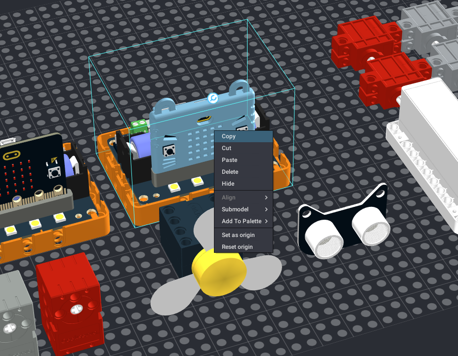

在新的檔案裡面貼上，模組就會複製到檔案裡面。

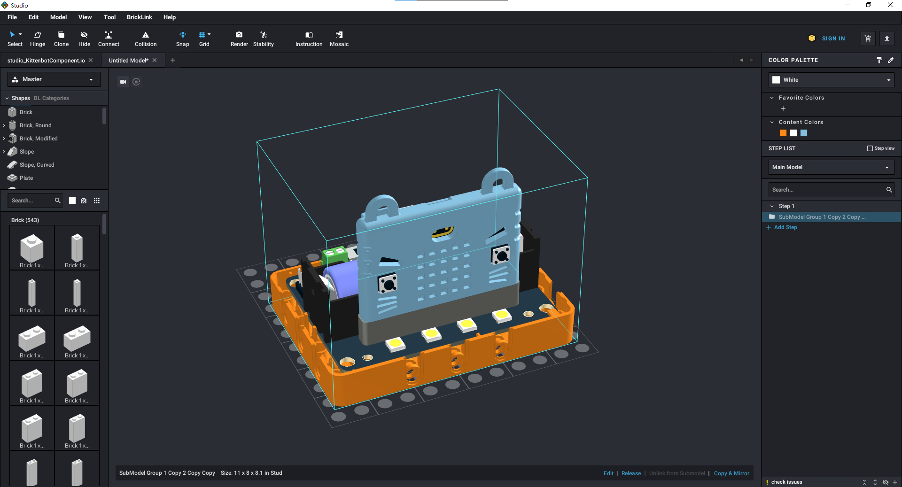

之後你就可以任意搭建模型啦～

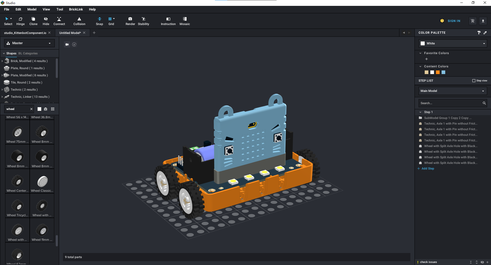

## 生成搭建說明書

要在Bricklink Studio裏創作出說明書，我們先要確保搭建步驟合理並且妥當。

在左邊的一欄按Add Step，添加一個新步驟。

在該步驟裡面拼砌該步驟所用的積木。

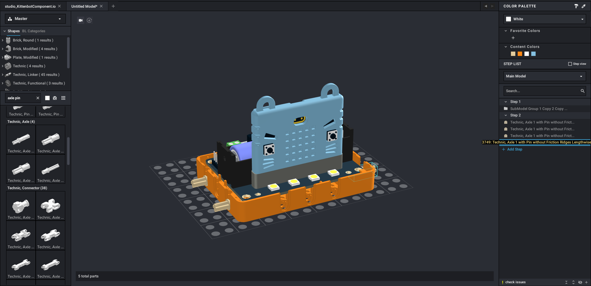

重複直至完成搭建你的模型。

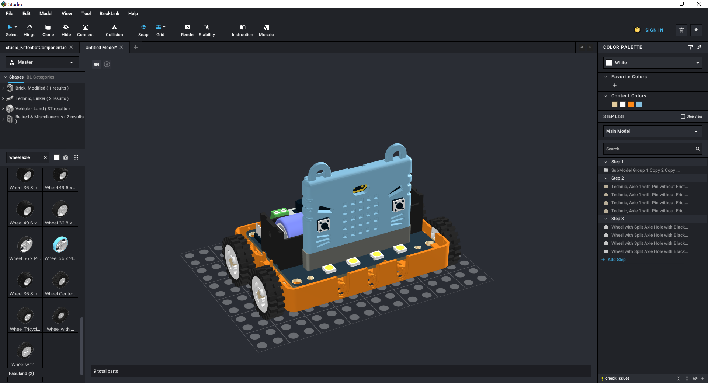

在上方按Instruction Maker。

在Steps Editor可以調整搭建步驟。

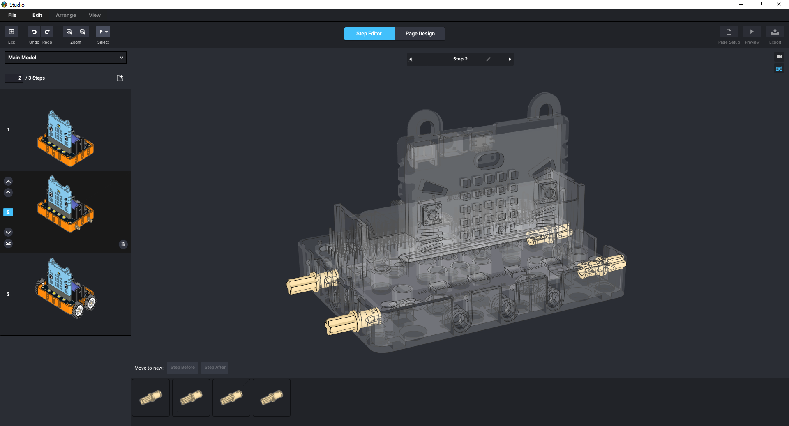

點擊Page Design，前往設計搭建說明書的頁面。

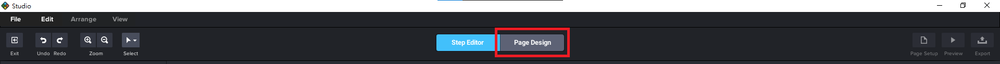

在Page Design，您可以選擇頁面的顏色，文字顏色等。

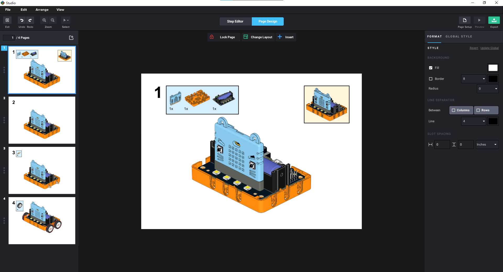

假如你想改變模型角度，可以選擇右邊的Change Step View。

完成之後，按Export，將說明書匯出。

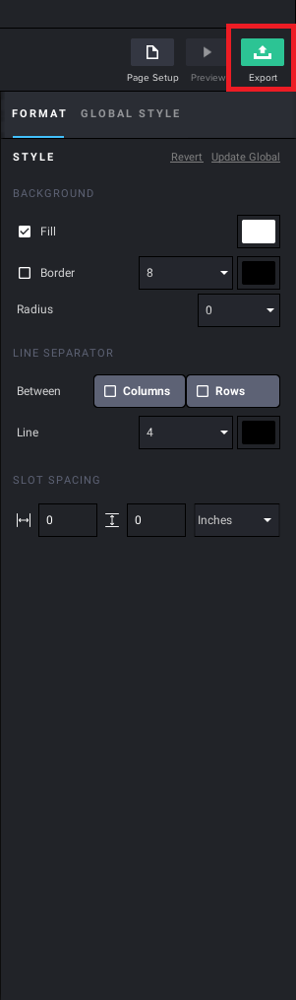

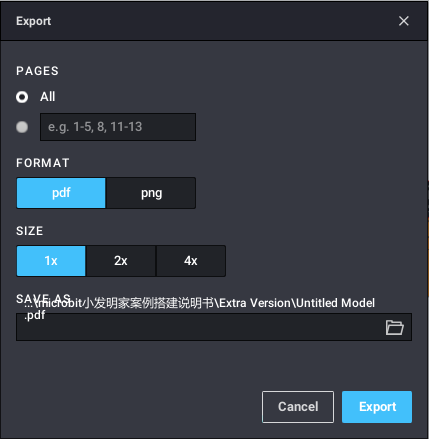

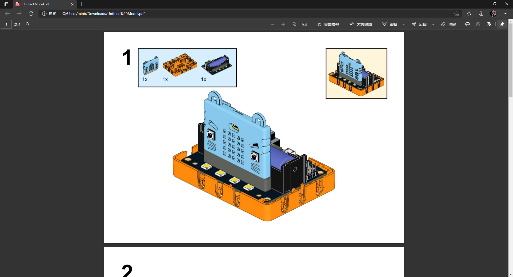

